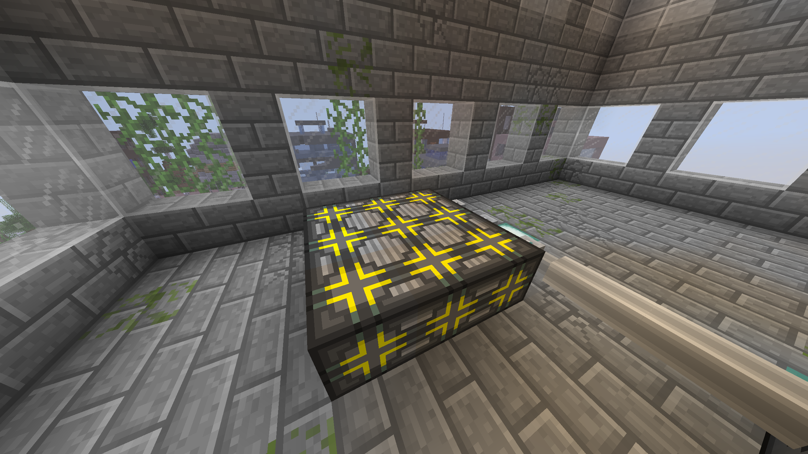
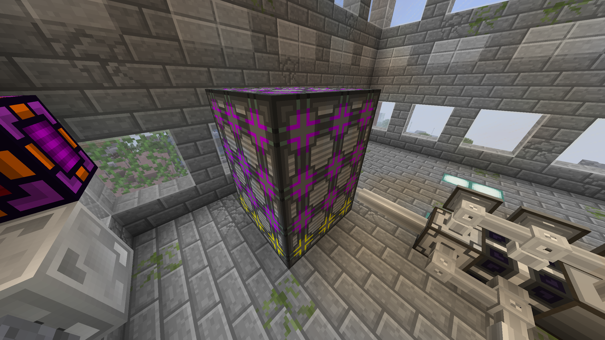
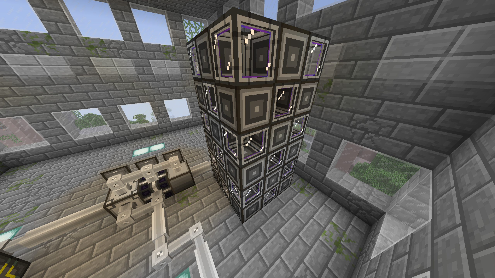
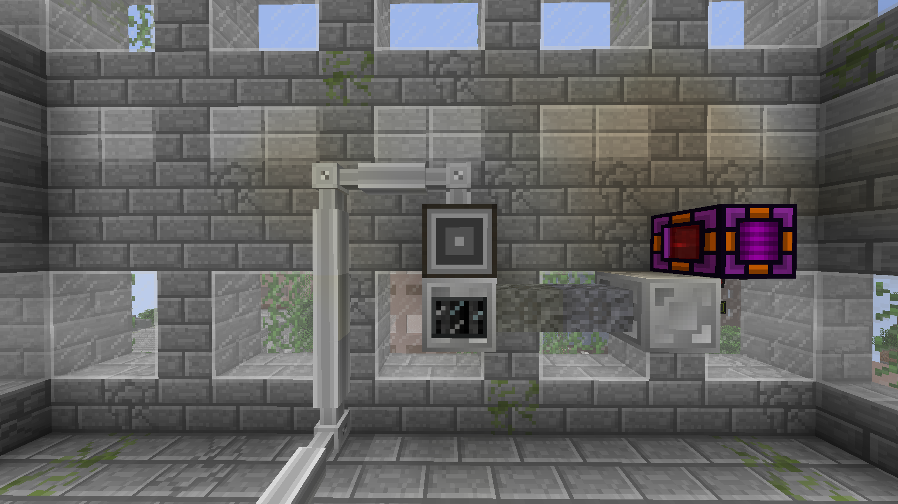

# Applied Energistics 2: Autocrafting
## (for dummies)

*Setup:*

To create your Autocrafting system, you first need to make an Applied Energistics ME System. Thankfully if you are reading this you should already know the basics,
you can find the guide to the basics of the ME system [here!](AE2ForDummies.md) Once you have your basic ME system up and running, 
we need to now create a small "Computer" to carry out the tasks. This is made with some Crafting Storages and Processor Units, **Crafting Storages** Are almost like RAM, 
The bigger and complicated the recipe you ask for, the more "RAM" it will take up. **Processor Units**  are used to help speed up the task you give your system, the more the
better! You can also make more than one of these "Computers" On a system, You might want to have more if you have dedicated complex tasks going in the background.

Let's say now you have *9x* 4K Storage Units, and *27x* Co-processing Units. Simply place the Storage Units in a 3x3 area, and build the processors in a 3x3x3 fashion above the Storage Units.
The blocks should change if the structure is complete, If you want to create a bigger one down the line, you make them up to a 17x17x17 size as a max. It **must** be a cuboid.

With the "Computer" complete, its time to make the 3x3 Crafting table (or just called Vanilla crafting) autocraftable. To do so, you need to make **ME Interfaces** And **Mollecular Assemblers.**
The Interface interacts with the assemblers telling them what to make, and the assemblers make the recipe. To set it up, you can create them in a simular tower shape to the starting "Computers" First,
take 5 assemblers, and create a X pattern within a 3x3 space, then fill the blanks of the 3x3 space with the ME Interfaces, for the next layer above this is reversed!
So ME interfaces in a X shape and then Assemblers, this allows allot of coverage over the Assemblers.

Next up, is to actually start creating and then Applying **Patterns,** they are used to localize a Interface to a recipe, when attached to a assembler it automatically creates the recipe and starts to make it,
but for modded machines, etc I will explain a bit later on! To create a pattern, use a **pattern terminal** to print your recipe into the pattern. It will look simular to a crafting terminal, 
but instead you have a slot to place in patterns and print them, and then a button to change the pattern mode. For now keep it on the Crafting table, place the recipe you want to make, 
you can do this quite easily by looking in JEI for the recipe you want in the pattern, and then clicking on the **+** button! This can also be done to add recipes you can't even make within your system manually!
For now, lets say you want to turn Wood > planks > sticks, first place the wood in the crafting space to get the output recipe, then click the arrow button underneath the pattern storages to imprint the code into your pattern.
*(Note, if you have old patterns you don't use anymore, or you make an accident, just put it into the input slot, they are reusable!)* Take the Encoded Pattern out, now you need a **interface Terminal** Which will show all available interfaces. Now simply place your Pattern inside a slot, now repeat this process for sticks! 
*(When your just doing basic/vanilla recipes, it is okay to leave them as is, but for the future, since you will need less interfaces for machines, it is wise to rename them in a anvil, to seperate their inventory by title within the terminal.)*

Now that this is all setup, to simply make your wanted item, go into your **Crafting Terminal.** The item you set to me autocraftable will appear on your system, It will display it with "craft." Simply click it and then request how many you want, it will then calculate and say if you can make it, if everything is good just simply start it and wait! 
*(click the hammer in the top right to see what is being made by each "Computer" you have made! If you do also want to autocraft an item that already is available, simply hit your middle mouse button to autocraft it!)*

*basic modded autocrafting:*

Lets say, you want to pump **copper ingots** ingot a **compressor** to turn into a **copper plate,** to do this, you need to have the machine exposed in a way to be automated easily,
such as having a clear space for input and output. First place a **ME interface** on a side of the machine. And have a **item conduit** set to extract and  pull the output item into the interface.
Now go to a **pattern interface** once again, and click the crafting table to turn it into a furnace. To set the recipe, make the plate yourself and put it into the output area, and then the ingot into the input area.
Once its into the proper interface, you can craft it! Lastly to note, Some machines will aslo come with a auto-output option, if this is the case you can set the output item from the machine to go right back into the interface so you don't need to waste any item conduits, you can also have your output go into any interface connected into the system for the recipe to be deemed as being complete.

