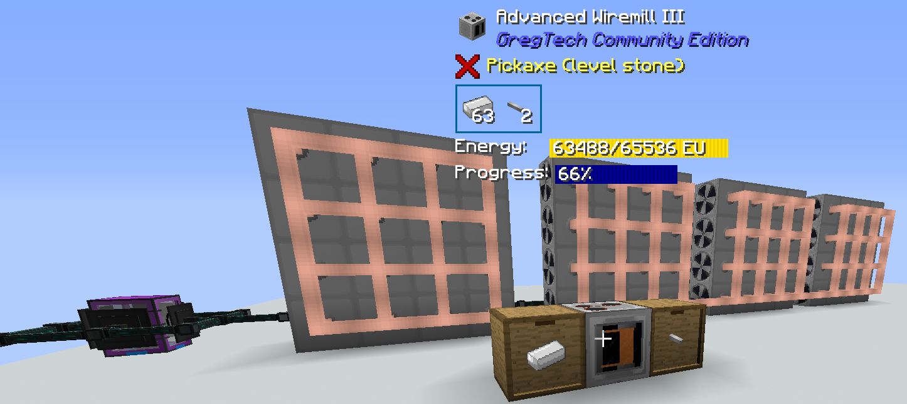

Valid for Omnifactory v.1.2.1
# How does GT(CE) electricity work
Electricity in Gregtech travels in _packets_. Those packets are created in very specific sizes - equal to the voltage of a GT power tier. For example, an LV packet is a "32V" packet meaning that it carries 32 EU. Packets can be sent by several blocks, most notably CEFs (in Omni), battery buffers and energy output hatches. Packets are only sent when there is a destination that has room for it. 

**Example 1**: a machine starts working from a full buffer of 1000EU and consuming 4 EU/t from it's internal buffer. It accepts LV current from an LV CEF (through a lossless cable or with the CEF pointed directly into the machine). In this case, the machine will work for 8 ticks before requesting and recieving a single packet from the CEF. It will then continue to send it a packet every 8 ticks. 

Note that in general, GT cables have **loss** - per every block traversed, the contents of a packet decrease. For example, if you transfer MV current with an 8-block-long cable with a loss of 2/block, every packet will reach the destination retaining 128-8*2=112 EU. That means that only 112/128=87.5% of energy will be transferred. However, Omnifactory has easily available lossless cables of every tier, so you don't need to worry about it. 

**Trying to feed a machine a higher voltage tier than its own will destroy it**. Thankfully, Omni has very forgiving configs and the machine will just evaporate instead of exploding like a bomb. Similarly, **a cable will burn up if fed higher-tier voltage.**

A packet per tick is called an **amp** (1A). In example 1, it can be said that the machine consumes (and recieves from the CEF) 4/32=0.125A of LV current. **Too many amps transferred through a cable will cause it to burn**. However, unlike GT5U and others, GTCE massively simplifies the calculations involved - it seems like it both doesn't take into account the _current_ amperage, only _potential_, so a 16x CEF connected to a single machine through a 4x cable would burn a cable, despite sending at worst two amps to it. *Additionally*, GTCE doesn't properly sum the amperage from multiple sources, resulting in this: [https://discordapp.com/channels/564247906991996928/564247906991996930/624408326155010078](https://discordapp.com/channels/564247906991996928/564247906991996930/624408326155010078 "https://discordapp.com/channels/564247906991996928/564247906991996930/624408326155010078"). Suffices to say, this cable should not be able to transfer that much power(**tl;dr: GTCE electricity is somewhat broken**).

 CEFs can give out either 4 or 16 amps (packets every tick) depending on their type. This is a hard limit - they can't go above it no matter what. As they are relatively smart and every GT machine has an internal buffer, **that can generally be split to as many machines as you want**. It will be able to supply them as long as their **total drain** in EU/t is less than the total power the CEF can give out (voltage times amperage). To calculate the power drain of a machine, **the overclocking guide** might be helpful. A single machine can request and get *up to two amperes* from a CEF (from a single cable connection) - although no recipes in GTCE have a EU/t of more than the machine's voltage, so *the second amp is only used to fill the buffer*. This second amp does, however, allow one to supply a machine of \<tier N\> with 2 cable connections to \<tier N-1\> current - or even one connection, if the machine currently draws less than half of its voltage. Along with the aforementioned amperage summing bug, this allows to create builds that *really* shouldn't work:

Some machines may accept use more than an amp. In GTCE, essentially the only such block is the **energy input hatch** - it can consume 2A, which is how you can smelt aluminium with LV current - by putting 2 LV hatches in the EBF and supplying both with 2A of LV, you reach 128 EU/t, which is enough for aluminium.

You might notice that a lot of those rules are quite complicated, _especially_ because they aren't even implemented correctly and bug-free in Omni's GTCE version. So, here's a 

**TL;DR**: **The Rules of Power**: 
1. Put the right cable on the output of a CEF: the same (or higher) voltage tier and the same (or higher) amperage than how many batteries fit into it. You can get away with less amps in _some_ cases, but it's best not to count on it. If you mess up here, **your cable will evaporate**. 
2. When putting a machine down, ensure it's the correct tier for the electricity you are going to be feeding to it. You can feed a machine with a lower voltage of electricity (although that's going to be hard - an MV machine can take up to 4 amperes of LV current in the worst case), but if you feed it a higher voltage tier, **the machine will be destroyed**.
