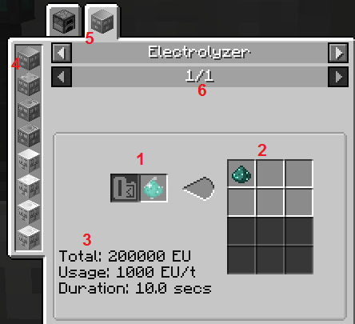
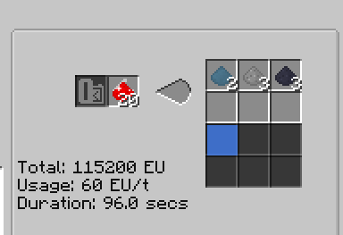
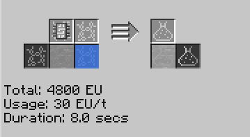

# Reading JEI recipes for GTCE machines

This guide aims to explain all the details JEI shows for GTCE machine recipes.

## Example 1: Enderpearl Electrolysis

We'll start with the obvious things everyone who has ever played modded minecraft should easily grasp. To the left is inputs(1), to the right is outputs(2). The darker-background slots are for fluids. This recipe has one item input (enderpearl dust) and one item output (pulsating dust). This window currently shows all recipes for Pulsating Dust, so there's more than one tab (5) - pulsating dust can also be obtained by smelting resonant clathrate in a furnace(and it's the better recipe). Finally, 6 is pages within the current category - here, there's only one recipe on one page, so it's showing it to be page 1 out of 1.

The other details, however, new players of this pack commonly have problems with. At the left, there's a column of machines (4). Those are *all machines that can execute this **category** of recipes*. This recipe is an Electrolyzer one, so the column shows all electrolyzers in the pack - from LV to UV tier. This is pretty useful, as high-tier machines sometimes aren't named just "Advanced <something> electrolyzer", but rather use a new name, like "Molecular Separator".

The **most important details** are the three lines of text(3). They show the **power requirements** of the recipe. The most important is Usage - how much power will a machine doing this recipe consume per tick (without [overclocking](Overclocking.md)). Duration, naturally, is how much time the process would take (again, without overclocking). (*This* is the **base recipe** mentioned in the overclocking guide). The top line, Total, is just total energy required for the recipe - to save you the trouble of multiplying usage by duration, converting seconds to ticks in the process.

Why is it important? Well, because **it shows what tier of the machine you need to execute this recipe**. The column 4 shows all electrolyzers, not just those that can do this recipe. To determine the minimal required tier of the machine, look at the Usage - the machine's voltage has to be more than or equal to it. Refer to the tier table:

Voltage is just quadrupled for each tier, so you'll remember this table in no time. Looking at it, though, you can see that the lowest tier with a voltage above 1000 EU/t is EV. Indeed, **this is a EV recipe** - there's no use trying to do it in a HV electrolyzer or below. This, and the massive total energy requirement, is why this recipe for pulsating dust isn't really used by anyone.

## Example 2: Almandine Electrolysis

20 almandine dust (the process won't start until at least that much is in the slot) gets decomposed into several dusts and some oxygen (you can see its amount by hovering over that slot). This uses 115200 EU over 96 seconds (a pretty long recipe!), so it needs 60 EU/t - an MV tier recipe.

## Example 3: Ethylene Polymerization

144mb Ethylene is reacted with 1b oxygen in a Chemical Reactor to form 216mb Polyethylene. There are several things to note here:
1) this is a Chemical Reactor recipe - note the very different slot arrangement, with many possible inputs and outputs.
2) this recipe uses a **programmed circuit**. They are used to distinguish between recipes share a common part, to ensure you never accidentally make something that you didn't intend.
3) not shown on the picture, but there are actually several different ethylene->polyethylene recipes. If you look at the inputs and outputs, you'll realise the pattern - compared to the "default" of using air as the second reactant(144mb ethylene->144 mb PE), oxygen provides 1.5x yield of polyethylene from the same ethylene amount, and adding some titanium tetrachloride gives another 1.5x, stacking additively. Having many alternative recipes like that is a pretty common situation - **always look through all JEI tabs and all the pages in them!**
4) as for power, there's nothing special - 30EU/t (4800EU for 8 seconds) makes it an LV recipe.
